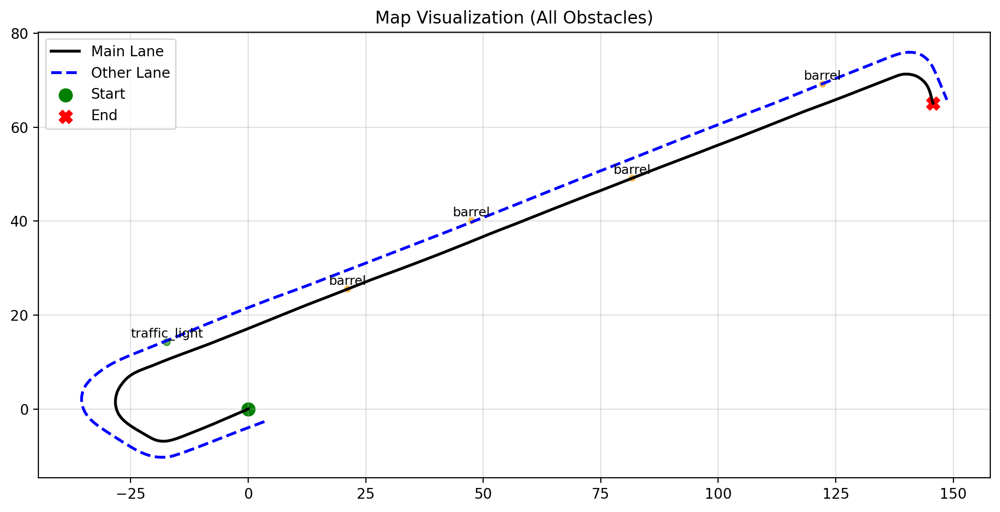
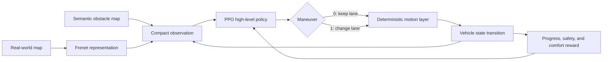
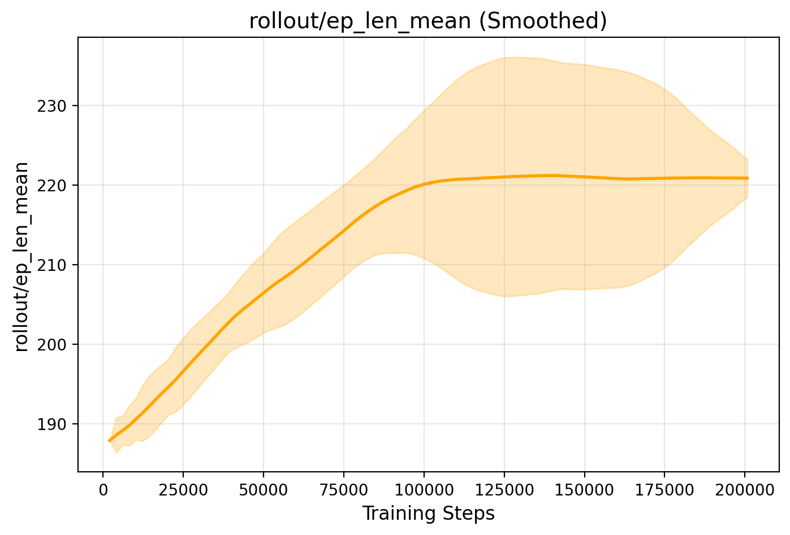
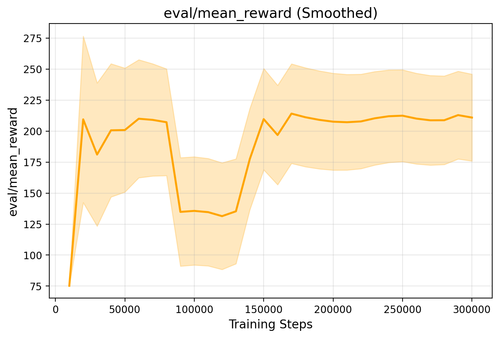

# Hierarchical Deep Reinforcement Learning for Robotaxi Decision-Making

<div align="center">

[](https://www.python.org/)
[](https://gymnasium.farama.org/)
[](https://stable-baselines3.readthedocs.io/)
[](https://arxiv.org/abs/1707.06347)

**A reproducible benchmark for learning lane-level maneuver decisions in a structured urban robotaxi scenario.**

[Overview](#overview) · [Methodology](#methodology) · [Results](#results) · [Quick start](#quick-start) · [Reproducibility](#reproducing-the-experiments)

</div>

---

## Overview

This project studies **high-level autonomous-driving decision-making** with hierarchical deep reinforcement learning. A PPO agent observes the ego vehicle's route progress, lane position, and lane-aware obstacle distances, then decides whether to keep its current lane or initiate a lane change. A deterministic motion layer executes the maneuver in Frenet coordinates.

The environment is built from real-world GPS data collected with the **Buckeye AutoDrive Chevrolet Bolt** and exposes a standard [Gymnasium](https://gymnasium.farama.org/) interface. Training, checkpointing, and evaluation use [Stable-Baselines3](https://stable-baselines3.readthedocs.io/), making the setup easy to inspect, extend, and compare with other reinforcement-learning algorithms.

The project is motivated by robotaxi missions in which a vehicle must make safe, interpretable maneuver decisions around road obstructions. The present benchmark deliberately isolates that decision layer: perception and low-level control are idealized so that experiments focus on the learned policy.

### Highlights

- Real-world-based, two-lane map represented in **Frenet coordinates**.
- Custom Gymnasium environment with compact semantic observations.
- Hierarchical design: learned high-level policy plus deterministic maneuver execution.
- PPO training with checkpoints, periodic evaluation, TensorBoard logs, and saved models.
- Scenario randomization for evaluating unseen obstacle layouts.
- Included maps, learning curves, trained checkpoints, and an animated rollout.

## Environment preview

<p align="center">
  
</p>

The black and blue curves are the lane centerlines. Obstacles are placed by longitudinal route position and lane, while the start and goal define the robotaxi mission.

<p align="center">
  
  <br>
  <em>Learned policy navigating randomized static-obstacle configurations.</em>
</p>

## Methodology

### Hierarchical decision architecture



The hierarchy is intentional: PPO learns **which maneuver to select**, while the lower layer deterministically translates that choice into longitudinal and lateral motion. This removes controller and perception noise from the current study and isolates high-level decision quality.

### Markov decision process

The task is modeled as an MDP

$$
\mathcal{M}=\langle\mathcal{S},\mathcal{A},T,R,\gamma\rangle,
$$

where the policy $\pi(a_t\mid o_t)$ maximizes expected discounted return.

#### Observation space

Each observation is a five-dimensional vector:

$$
o_t = [\tilde{s}_t,\ d_t,\ \ell_t,\ \delta_t^{\mathrm{current}},\ \delta_t^{\mathrm{adjacent}}].
$$

| Component | Meaning | Range in the environment |
|---|---|---:|
| $\tilde{s}_t$ | Normalized progress along the reference route | $[0,1]$ |
| $d_t$ | Lateral offset from the main centerline | $[-20,20]$ m |
| $\ell_t$ | Current lane ID | $\{0,1\}$ |
| $\delta_t^{\mathrm{current}}$ | Distance to the nearest obstacle ahead in the current lane | $[0,50]$ m |
| $\delta_t^{\mathrm{adjacent}}$ | Distance to the nearest obstacle ahead in the other lane | $[0,50]$ m |

Obstacle distance is a compact, lane-aware semantic measurement. A value of 50 m represents no detected obstacle within the observation horizon.

#### Action space

The current implementation uses `Discrete(2)`:

| Action | High-level behavior |
|---:|---|
| `0` | Keep the current lane |
| `1` | Initiate a lane change to the adjacent lane |

Once initiated, a lane change is completed by the deterministic motion layer before another lane-change command can begin.

#### Transition model

The default simulator advances at $\Delta t=0.1$ s with a reference speed of 10 m/s. Longitudinal progress is therefore 1 m per decision step, and lateral motion is limited to 0.4 m per step until the target lane center is reached. Map geometry is converted between Cartesian $(x,y)$ and Frenet $(s,d)$ coordinates by `utils/frenet.py`.

#### Reward design

The implemented reward balances route progress, collision avoidance, lane tracking, and maneuver economy:

$$
r_t = \Delta s_t
- 50\,\mathbf{1}_{\mathrm{collision}}
- 0.1\left|d_{t+1}-d_{\mathrm{lane}}\right|
- \lambda_{\mathrm{lc}}\,\mathbf{1}_{\mathrm{lane\ change}}.
$$

The training entry point sets $\lambda_{\mathrm{lc}}=1.5$. This discourages unnecessary oscillation between lanes while still allowing evasive maneuvers when an obstacle blocks the route.

### PPO training

The agent is an actor-critic multilayer perceptron trained with Proximal Policy Optimization (PPO). PPO constrains policy updates through a clipped surrogate objective, providing stable learning for the discrete maneuver policy.

| Hyperparameter | Value |
|---|---:|
| Policy | Actor-Critic MLP |
| Discount factor $\gamma$ | 0.99 |
| Learning rate | $3\times10^{-4}$ |
| Rollout length | 2,048 steps |
| Batch size | 64 |
| Entropy coefficient | 0.01 |
| PPO clipping range | 0.2 |
| Training budget | 300,000 timesteps |
| Evaluation frequency | 10,000 timesteps |
| Checkpoint frequency | 50,000 timesteps |

## Results

### Randomized-scenario generalization

The study evaluated the learned policy on **50 previously unseen scenarios**, each containing between 1 and 10 obstacles at randomized Frenet positions and lane assignments.

| Metric | Result |
|---|---:|
| Success rate | **49 / 50 (98%)** |
| Collision rate | **1 / 50 (2%)** |
| Average episode reward | **213.44** |
| Average episode length | **218.5 steps** |
| Average minimum obstacle distance | **0.30 m** |

These results show that the policy learned a stable relationship between lane-level obstacle observations and maneuver selection, retaining a high completion rate under obstacle layouts not seen during training. Because the benchmark assumes perfect perception, deterministic maneuver execution, and static obstacles, these numbers should be interpreted as decision-layer results rather than full-stack autonomous-driving performance.

### Learning behavior

<table>
  <tr>
    <td width="50%">
      
    </td>
    <td width="50%">
      
    </td>
  </tr>
  <tr>
    <td align="center"><em>Mean rollout episode length</em></td>
    <td align="center"><em>Mean evaluation reward</em></td>
  </tr>
</table>

Episode length rises and stabilizes near the route horizon as early collision terminations become less frequent. Evaluation reward follows the same overall trend and recovers after an exploratory performance drop. In the included `2025-12-08_10-21-13` training log, the evaluation callback at 300,000 timesteps records **210.89 ± 2.56 reward** and **222.60 ± 3.07 steps**.

Raw, smoothed, optimization, and timing plots are available in [`logs/2025-12-08_10-21-13/tensorboard/metrics`](logs/2025-12-08_10-21-13/tensorboard/metrics).

## Libraries and tools

| Library | Role |
|---|---|
| [Gymnasium](https://gymnasium.farama.org/) | Environment API, observation spaces, and discrete action space |
| [Stable-Baselines3](https://stable-baselines3.readthedocs.io/) | PPO implementation, monitoring, checkpoints, and evaluation callbacks |
| [PyTorch](https://pytorch.org/) | Neural-network backend used by Stable-Baselines3 |
| [NumPy](https://numpy.org/) | Frenet geometry, state representation, and numerical operations |
| [Matplotlib](https://matplotlib.org/) | Environment rendering, map inspection, and metric plots |
| [PyYAML](https://pyyaml.org/) | Scenario and obstacle configuration |
| [TensorBoard](https://www.tensorflow.org/tensorboard) | Training telemetry and experiment inspection |
| [ImageIO](https://imageio.readthedocs.io/) | Animated rollout export |

Map preprocessing utilities also use Python's standard XML parser to inspect the Lanelet/OpenStreetMap source.

## Quick start

### 1. Clone and create an environment

```bash
git clone https://github.com/donfigob/hierarchical_rl_robotaxi.git
cd hierarchical_rl_robotaxi

python3 -m venv .venv
source .venv/bin/activate
python -m pip install --upgrade pip
python -m pip install gymnasium stable-baselines3 numpy matplotlib pyyaml tensorboard imageio
```

### 2. Run the environment

```bash
python test.py
```

This launches a random-policy rollout using the map and obstacles in `config/`.

### 3. Evaluate the included trained policy

```bash
python train/eval_model.py
```

The script loads `logs/2025-12-08_10-21-13/models/best_model.zip` and renders deterministic PPO decisions.

## Reproducing the experiments

### Train PPO

Create a run directory and pass it to the training entry point:

```bash
RUN_DIR="logs/$(date +%Y-%m-%d_%H-%M-%S)"
mkdir -p "$RUN_DIR"
python visualization/plot_map.py --output_dir "$RUN_DIR"
python train/train_ppo.py --run_dir "$RUN_DIR"
```

Every run is organized as follows:

```text
logs/<timestamp>/
├── eval_logs/          # periodic evaluation arrays
├── models/             # best and final PPO policies
├── ppo_checkpoints/    # snapshots every 50k steps
├── tensorboard/        # TensorBoard event stream and exported plots
├── hparams.json        # core hyperparameters
├── map_visualization.png
├── train.out
└── train.err
```

For an HPC run, submit the provided Slurm configuration:

```bash
sbatch train.sbatch
```

Before submitting on another cluster, update the Slurm account and the repository path in `train.sbatch` for that system.

### Inspect training in TensorBoard

```bash
tensorboard --logdir logs
```

To export every logged scalar as raw and smoothed PNG curves:

```bash
python visualization/generate_metrics.py --run_dir logs/<timestamp>
```

### Regenerate the map visualization

```bash
python visualization/plot_map.py --output_dir config
```

Edit [`config/obstacles.yaml`](config/obstacles.yaml) to change obstacle positions, lane assignments, and collision radii before training or evaluation.

## Repository structure

```text
hierarchical_rl_robotaxi/
├── config/             # OSM map, lane centerlines, obstacles, and map assets
├── env/                # Gymnasium environment and supporting models
├── train/              # PPO training, evaluation, randomized testing, GIF export
├── utils/              # Cartesian ↔ Frenet coordinate conversion
├── visualization/      # map inspection, preprocessing, and metric generation
├── logs/               # experiment artifacts, checkpoints, plots, and models
├── train_local.sh      # local timestamped training workflow
├── train.sbatch        # Slurm training workflow
└── test.py             # random-policy environment smoke test
```

## Assumptions and scope

This repository is a controlled research benchmark, not a production driving stack. Its current scope assumes:

- static road obstacles and no interaction with other vehicles;
- perfect, instantaneous obstacle localization;
- deterministic longitudinal and lateral motion;
- successful low-level maneuver execution;
- a fixed two-lane route and discrete keep/change-lane decisions;
- circular collision geometry.

These assumptions make it possible to study high-level decision learning cleanly. Natural next steps include dynamic agents, noisy or delayed perception, explicit stop/light semantics, richer action sets, realistic vehicle dynamics, uncertainty-aware safety constraints, and comparisons against DQN, SAC, rule-based, or imitation-learning baselines.

## Citation

If this repository supports your research, please cite it as:

```bibtex
@misc{bautista2025hierarchical,
  author       = {Cristian Bautista and Qadeer Ahmed},
  title        = {Hierarchical Deep Reinforcement Learning for Maneuver
                  Decision-Making in Autonomous Driving},
  year         = {2025},
  howpublished = {GitHub repository},
  url          = {https://github.com/donfigob/hierarchical_rl_robotaxi}
}
```

## Acknowledgments

This work was developed at **The Ohio State University Center for Automotive Research** and was inspired by the **SAE/General Motors AutoDrive Challenge II**.
